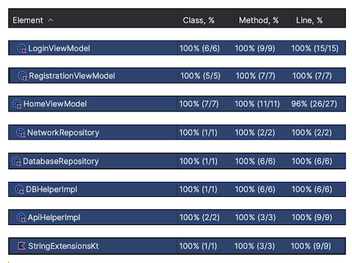

# MyWeatherApp
WeatherAssignment is an Android application built using Kotlin and designed with MVVM Clean architecture. This app fetches users live location after login or registration and show the current weather. Also it save the history of weather and shows a history list in history page. The app utilizes HILT for dependency injection, Compose for UI, Room for local database storage, Fused Location API for obtaining the current location, and the OpenWeatherMap API for fetching weather information. It also incorporates a Splash Screen API for a smooth startup experience.

## Features
- MVVM Clean Architecture:
- Dependency Injection with HILT:
- Compose for UI:
- Room Database:
- Fused Location API:
- OpenWeatherMap API:
- Splash Screen API:
- Login and Registration:
- Compose Navigation: 

## Dependencies
- HILT
- Jetpack Compose
- Room Database
- Fused Location Provider
- OpenWeatherMap API
- Retrofit
- JUnit
- Kluent
- Mockito
- SqlCipher

## Unit Test
This repository provides a comprehensive unit testing setup for Android applications using JUnit, Mockito, and Kluent. The testing framework is designed to ensure the reliability, correctness, and maintainability of the application codebase.

### Key Components
- JUnit
- Mockito
- Kluent

### Unit test results
Unit test results covers above 95% of code coverage.
- 

## Project Structure
The project is organized into the following directories:

### data
This directory encapsulates all data-related components. It includes subdirectories for various data models and operations:

#### - Location: 
Defines data models related to location.
#### - Api: 
Contains classes for handling API requests and responses.
#### - Database: 
Contains Data Access Object (DAO) and Entity classes for database operations.

### DI (Dependency Injection)
The DI directory manages dependency injection modules for different aspects of the application:

#### - DB Module: 
Handles dependency injection related to the database.
#### - Network Module: 
Manages dependency injection for network-related components.

### repository
The repository directory serves as the bridge between the data and the rest of the application. It is further divided into:

#### - Database Repository: 
Manages data interactions with the local database.
#### - Network Repository: 
Handles data interactions with remote APIs.
### resource
The resource directory is dedicated to utility classes that can be utilized across different parts of the application.

### feature
The feature directory is subdivided into specific features/modules of the application:

#### - Home: 
Contains files related to the home feature.
#### - Login: 
Contains files associated with user login functionality.
#### - Registration: 
Manages user registration-related components.
#### - Weather History: 
Encompasses files related to displaying weather history.
Each feature module consists of Compose UI (User Interface) and ViewModel components.

## Security

#### - SQLCipher Encryption in Room DB

Our application employs [SQLCipher](https://www.zetetic.net/sqlcipher/) for encrypting sensitive data stored in the Room Database. SQLCipher provides robust encryption mechanisms, ensuring the confidentiality of user data.

#### - ProGuard for Code Obfuscation

To enhance the security of our application, we utilize [ProGuard](https://www.guardsquare.com/products/proguard) for code obfuscation. ProGuard helps make reverse engineering more challenging, protecting sensitive code and assets from unauthorized access.

## Getting Started
Clone the repository: git clone https://github.com/saurabhpere/MyWeatherApp

Open the project in Android Studio.

### Adding API Key to `native-lib.cpp`
To integrate your API key you need to put OpenWeatherMap api key in base64 form into the `native-lib.cpp` file, follow these steps:
1. Open the `cpp/native-lib.cpp` file in your preferred text editor.
2. Locate the section where the API key needs to be added.
3. Replace the placeholder `BASE64_API_KEY_HERE` with your actual API key encoded in base64.
4. Save the changes to the `native-lib.cpp` file.
```cpp
// cpp/native-lib.cpp

std::string api_key = "BASE64_API_KEY_HERE"; // Replace with your actual API key in base64
// ...
```

Build and run the app on an emulator or physical device.

## Contributing
Feel free to contribute to the WeatherAssignment project by opening issues, providing feedback, or submitting pull requests. Your contributions are highly appreciated.